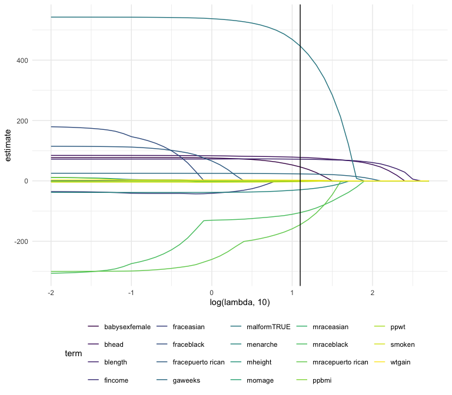
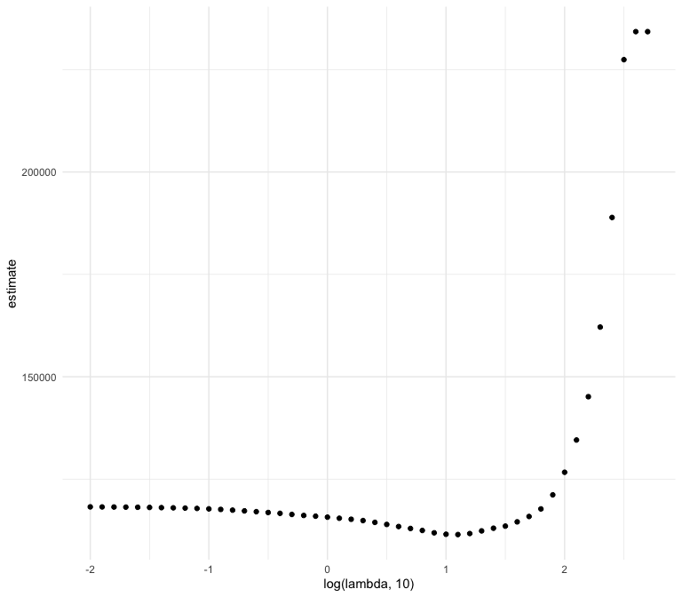

stat_learning
================

``` r
library(tidyverse)
```

    ## ── Attaching core tidyverse packages ──────────────────────── tidyverse 2.0.0 ──
    ## ✔ dplyr     1.1.4     ✔ readr     2.1.5
    ## ✔ forcats   1.0.0     ✔ stringr   1.5.1
    ## ✔ ggplot2   3.5.2     ✔ tibble    3.3.0
    ## ✔ lubridate 1.9.4     ✔ tidyr     1.3.1
    ## ✔ purrr     1.1.0     
    ## ── Conflicts ────────────────────────────────────────── tidyverse_conflicts() ──
    ## ✖ dplyr::filter() masks stats::filter()
    ## ✖ dplyr::lag()    masks stats::lag()
    ## ℹ Use the conflicted package (<http://conflicted.r-lib.org/>) to force all conflicts to become errors

``` r
library(glmnet)
```

    ## Loading required package: Matrix
    ## 
    ## Attaching package: 'Matrix'
    ## 
    ## The following objects are masked from 'package:tidyr':
    ## 
    ##     expand, pack, unpack
    ## 
    ## Loaded glmnet 4.1-10

``` r
knitr::opts_chunk$set(
  fig.width = 8,
  fig.height = 7,
  fig.align = "center",
  out.width = "90%"
)

theme_set(theme_minimal() + theme(legend.position = "bottom"))

options(
  ggplot2.continuous.colour = "viridis",
  ggplot2.continuous.fill = "viridis"
)

scale_colour_discrete = scale_colour_viridis_d
scale_fill_discrete = scale_fill_viridis_d
```

``` r
set.seed(11)
```

``` r
bwt_df = 
  read_csv("data/extra_topic_data/birthweight.csv") |> 
  janitor::clean_names() |>
  mutate(
    babysex = 
        case_match(babysex,
            1 ~ "male",
            2 ~ "female"
        ),
    babysex = fct_infreq(babysex),
    frace = 
        case_match(frace,
            1 ~ "white",
            2 ~ "black", 
            3 ~ "asian", 
            4 ~ "puerto rican", 
            8 ~ "other"),
    frace = fct_infreq(frace),
    mrace = 
        case_match(mrace,
            1 ~ "white",
            2 ~ "black", 
            3 ~ "asian", 
            4 ~ "puerto rican",
            8 ~ "other"),
    mrace = fct_infreq(mrace),
    malform = as.logical(malform)) |> 
  sample_n(200)
```

    ## Rows: 4342 Columns: 20
    ## ── Column specification ────────────────────────────────────────────────────────
    ## Delimiter: ","
    ## dbl (20): babysex, bhead, blength, bwt, delwt, fincome, frace, gaweeks, malf...
    ## 
    ## ℹ Use `spec()` to retrieve the full column specification for this data.
    ## ℹ Specify the column types or set `show_col_types = FALSE` to quiet this message.

Data processing

``` r
x= model.matrix(bwt~., bwt_df)[,-1]
y= bwt_df |> pull(bwt)
```

Define some lambdas and fit Lasso for each

``` r
lambda = 10^(seq(-2, 2.75, 0.1)) # what comes after the comma is the increment length

#Fit lasso to balance RSS and penalty on regression coefficients
lasso_fit =
  glmnet(x=x, y=y, lambda = lambda) # glmnet fits all the lassos you care about for the lambda value
# Lambda is a way to balance prediction accuracy in RSS with parameters in model (lambda tells you which is the best one).

lasso_cv =
  cv.glmnet(x=x, y=y, lambda = lambda)

lambda_opt = lasso_cv[["lambda.min"]]
```

Evaluate what’s happening within lasso fit. Plot 1: Line path for where
the predictors are

``` r
lasso_fit |>
  broom::tidy() |> #Using "view ()" we see that for every lambda value we get the coefficient we care about
  select(term, lambda, estimate) |>
  complete(term, lambda, fill = list(estimate =0)) |>
  filter(term != "(Intercept)") |>
  ggplot(aes(x= log(lambda,10), y=estimate, group = term, color =term)) +
  geom_line()+
  geom_vline(xintercept = log(lambda_opt, 10))
```



``` r
#As lambda gets small, we see all predictors in model (too much), as it's larger, there's not enough stuff in model to make good predictions about birth weight. The V-line shows the sweet spot (by using cross-validation)
```

Plot 2:

``` r
lasso_cv |>
  broom::tidy() |>
  ggplot(aes(x = log(lambda, 10), y = estimate)) +
  geom_point()
```


